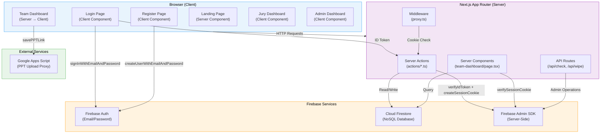
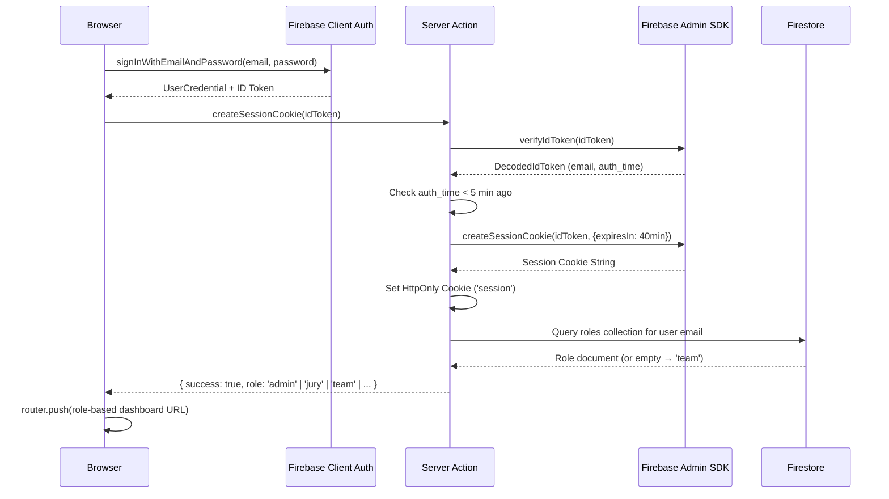

# 02 — System Architecture

## High-Level Architecture Diagram

## Component Breakdown

### 1. Client Layer (Browser)

The client layer consists of React components rendered either as **Server Components** (SSR) or **Client Components** (`'use client'`).

| Component | Rendering | Description |
|---|---|---|
| Landing Page (`/`) | Server Component | Static marketing page with 9 sections (NavBar, Hero, About, Themes, Timeline, Rules, Testimonials, FAQ, Contact). |
| Login (`/login`) | Client Component | Firebase Client Auth sign-in → Server Action to mint session cookie → role-based redirect. |
| Register (`/register`) | Client Component | Multi-step form with Zod validation, live uniqueness checks, Firebase Auth user creation. |
| Team Dashboard (`/team-dashboard`) | **Server → Client** | Server Component verifies session + fetches data, then passes to `TeamDashboardClient` Client Component. |
| Jury Dashboard (`/jury-dashboard`) | Client Component | Client-side session verification via Server Action, then full dashboard rendering. |
| Admin Dashboard (`/admin/*`) | Client Component | Client-side session verification, tabbed layout with 7 sub-pages. |

### 2. Next.js Server Layer

#### Middleware (`proxy.ts`)

The middleware intercepts requests at the edge and enforces route protection:

- **Protected Routes:** `/team-dashboard`, `/admin`, `/jury-dashboard`, `/student-coord-dashboard`, `/faculty-coord-dashboard` — redirects to `/login` if no session cookie exists.
- **Auth Routes:** `/login`, `/register` — redirects authenticated users to `/team-dashboard`.

> **Note:** The file is named `proxy.ts` instead of the conventional `middleware.ts`. This is a custom naming convention.

#### Server Actions (`src/app/actions/`)

All data mutations go through Next.js Server Actions (`'use server'`):

| File | Responsibilities |
|---|---|
| `session.ts` | Session cookie creation/clearing, role resolution (with in-memory cache), admin email whitelist. |
| `auth.ts` | Team registration data persistence, team name uniqueness checks, batch number validation, PPT submission, team data retrieval by email. |
| `drive.ts` | PPT submission timeline check, saving PPT links to Firestore. |
| `forgot-password.ts` | Email registration verification, password change with old-password validation via Firebase Auth REST API. |

#### Admin Server Actions (`src/app/admin/actions.ts`)

A monolithic 2,244-line file containing all admin operations:
- Session verification (`verifyAdminSession`)
- CRUD for teams, evaluations, labs, final labs, game scores
- Event timeline management (4-phase lifecycle)
- Auto-allocation algorithms (teams → labs based on theme matching)
- PPT filter application
- Finalist promotion
- Winner declaration
- Dummy data seeding

#### API Routes (`src/app/api/`)

| Route | Purpose |
|---|---|
| `/api/check` | Health check endpoint. |
| `/api/wipe` | Data wipe endpoint (administrative). |

### 3. Firebase Services

#### Firebase Authentication (Client SDK)

- **Provider:** Email/Password only.
- **Usage:** Client-side sign-in (`signInWithEmailAndPassword`) and user creation (`createUserWithEmailAndPassword`).
- The client SDK is initialized in `src/lib/firebase.ts` using `NEXT_PUBLIC_*` environment variables.

#### Firebase Admin SDK (Server-Side)

- Initialized in `src/lib/firebase-admin.ts` using service account credentials (`FIREBASE_CLIENT_EMAIL`, `FIREBASE_PRIVATE_KEY`).
- Used for:
  - **Session cookie management:** `createSessionCookie`, `verifySessionCookie`.
  - **User management:** `createUser`, `deleteUser`, `getUserByEmail`, `updateUser`, `listUsers`.
  - **Firestore operations:** All server-side reads/writes go through `getAdminDb()`.

#### Cloud Firestore (NoSQL Database)

Seven primary collections:
- `teams` — Registered hackathon teams.
- `roles` — Privileged user role mappings (admin, jury, student-coord, faculty-coord).
- `evaluations` — Unified scoring records (prelims/finale) from admin.
- `prelimsEvaluations` — Prelims scoring records from jury dashboard.
- `gameScores` — Game XP records from coordinators.
- `labs` — Prelims lab configurations.
- `finalLabs` — Finale lab configurations.
- `metadata` — Global counters and event timeline state.

### 4. External Services

#### Google Apps Script

- A Google Apps Script endpoint (`NEXT_PUBLIC_GOOGLE_SCRIPT_URL`) is configured for PPT upload proxy functionality.
- Teams can submit PPT presentations through this integration.

## Authentication Flow

## Session Management

- **Session Duration:** 40 minutes (`expiresIn = 40 * 60 * 1000`).
- **Cookie Attributes:** `httpOnly: true`, `secure: true` (production), `sameSite: 'lax'`, `path: '/'`.
- **Session Verification:** Every protected page/action calls `verifySessionCookie(sessionCookie, true)` — the `true` flag checks if the session has been revoked.
- **Client-Side Sync:** On the login page, `signOut(auth)` is called in `useEffect` to forcefully clear any stale Firebase Client Auth state.

## Caching Strategy

The application employs two levels of server-side caching:

1. **Role Cache** (in `session.ts`):
   - In-memory `Map<string, { role, timestamp }>`.
   - TTL: 5 minutes.
   - Falls back to stale cache on Firestore quota errors.

2. **Collection Cache** (in `admin/actions.ts`):
   - In-memory `Map<string, CacheEntry>`.
   - TTL: 30 seconds.
   - Used for `teams`, `labs`, `roles`, `gameScores`, `metadata_eventTimelines`.
   - Invalidated explicitly via `invalidateCollectionCache()` after mutations.

3. **Next.js `unstable_cache`**:
   - Used for `getCachedTeamsData` with a 5-minute revalidation period.

## Deployment

The application is designed to be deployed on **Vercel** (Next.js native hosting):

- Server Actions and API Routes run as serverless functions.
- Static pages are pre-rendered at build time.
- Environment variables are configured through the Vercel dashboard.

> **Note:** Firebase Storage is **not currently used**. PPT files are stored via Google Drive (Google Apps Script integration).

---

> **Related Documents:** [06_Firebase_Documentation](./06_Firebase_Documentation.md) · [07_Database_Design](./07_Database_Design.md) · [10_Authentication_Flow](./10_Authentication_Flow.md)
