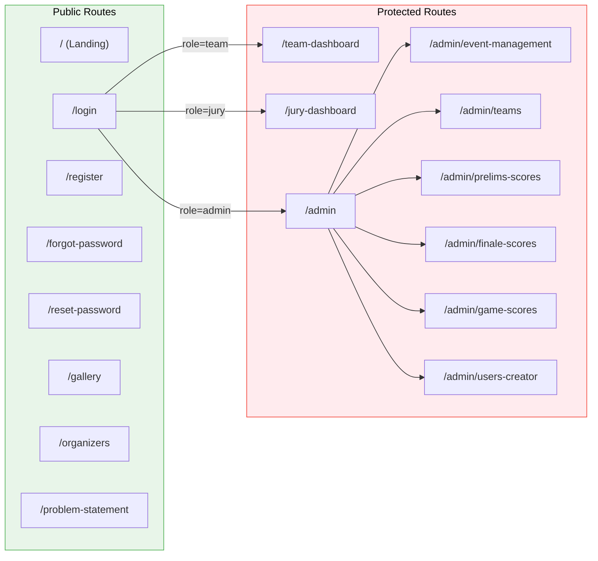
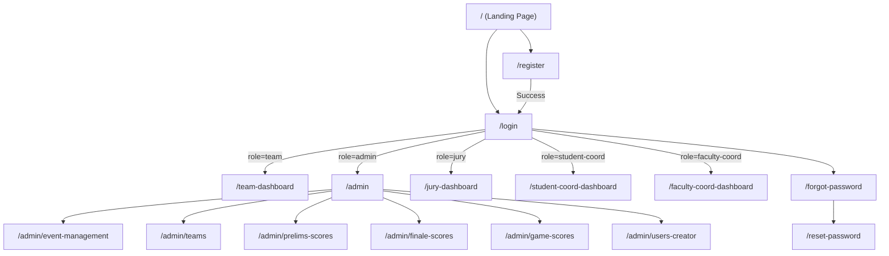

# 04 — Routing Guide

## Route Map



## Pages

| Route | File | Rendering | Auth Required | Allowed Roles |
|---|---|---|---|---|
| `/` | `app/page.tsx` | Server Component | No | All |
| `/login` | `app/login/page.tsx` | Client Component | No | All (redirects if authenticated) |
| `/register` | `app/register/page.tsx` | Client Component | No | All |
| `/forgot-password` | `app/forgot-password/page.tsx` | Client Component | No | All |
| `/reset-password` | `app/reset-password/page.tsx` | Client Component | No | All |
| `/gallery` | `app/gallery/page.tsx` | Placeholder | No | All |
| `/organizers` | `app/organizers/page.tsx` | Placeholder | No | All |
| `/problem-statement` | `app/problem-statement/page.tsx` | Placeholder | No | All |
| `/team-dashboard` | `app/team-dashboard/page.tsx` | Server Component | Yes | `team` only |
| `/jury-dashboard` | `app/jury-dashboard/page.tsx` | Client Component | Yes | `jury` only |
| `/admin` | `app/admin/page.tsx` | Client Component | Yes | `admin` only |
| `/admin/event-management` | `app/admin/event-management/page.tsx` | Client Component | Yes | `admin` only |
| `/admin/teams` | `app/admin/teams/page.tsx` | Client Component | Yes | `admin` only |
| `/admin/prelims-scores` | `app/admin/prelims-scores/page.tsx` | Client Component | Yes | `admin` only |
| `/admin/finale-scores` | `app/admin/finale-scores/page.tsx` | Client Component | Yes | `admin` only |
| `/admin/game-scores` | `app/admin/game-scores/page.tsx` | Client Component | Yes | `admin` only |
| `/admin/users-creator` | `app/admin/users-creator/page.tsx` | Client Component | Yes | `admin` only |

## Dynamic Routes

This project does **not** use dynamic routes (`[param]`). All routes are static. Teams and evaluations are identified by query parameters or IDs passed through Server Actions.

## Layouts

### Root Layout (`app/layout.tsx`)
- Applies to **all pages**.
- Sets up Google Fonts (Geist Sans, Geist Mono).
- Defines page metadata (title: "Hackwell 2.O").
- Applies `min-h-full flex flex-col` to body.

### Admin Layout (`app/admin/layout.tsx`)
- Applies to **all `/admin/*` routes**.
- Renders the admin header with:
  - Logo and title.
  - Logged-in admin email display.
  - Logout button.
  - 7-tab horizontal navigation bar.
- Active tab is highlighted based on `usePathname()`.
- `'use client'` — uses Firebase Auth `onAuthStateChanged` to display admin email.

> **Note:** No separate layouts exist for `/jury-dashboard` or `/team-dashboard`. These pages implement their own header/navigation internally.

## Navigation Flow



## Protected Routes

Protection is enforced at **two levels**:

### Level 1: Edge Middleware (`proxy.ts`)

The middleware runs on every request matching protected route patterns. It checks for the presence of a `session` cookie:

```typescript
const protectedRoutes = [
  '/team-dashboard',
  '/admin',
  '/jury-dashboard',
  '/student-coord-dashboard',
  '/faculty-coord-dashboard'
];
```

- **No cookie** → Redirect to `/login`.
- **Has cookie on `/login` or `/register`** → Redirect to `/team-dashboard`.

### Level 2: Page-Level Authorization

Each protected page performs a **second verification** that checks both session validity AND user role:

| Page | Verification Method |
|---|---|
| `/team-dashboard` (Server Component) | `getAdminAuth().verifySessionCookie()` + `getUserRole()` — must be `'team'`. |
| `/jury-dashboard` (Client Component) | Calls `verifyJurySession()` Server Action — must be `'jury'`. |
| `/admin/*` (Client Component) | Calls `verifyAdminSession()` Server Action — must be `'admin'`. |

If the role check fails, the user is redirected to `/` (home) or `/login`.

## Public Routes

All routes not listed in the `protectedRoutes` array are publicly accessible. The registration page additionally checks the event timeline status server-side to determine if registration is currently open.

## API Routes

| Endpoint | Method | Purpose |
|---|---|---|
| `/api/check` | GET | Health check — returns server status. |
| `/api/wipe` | POST | Administrative data wipe (requires admin verification). |

---

> **Related Documents:** [02_System_Architecture](./02_System_Architecture.md) · [10_Authentication_Flow](./10_Authentication_Flow.md) · [13_Security_Documentation](./13_Security_Documentation.md)
