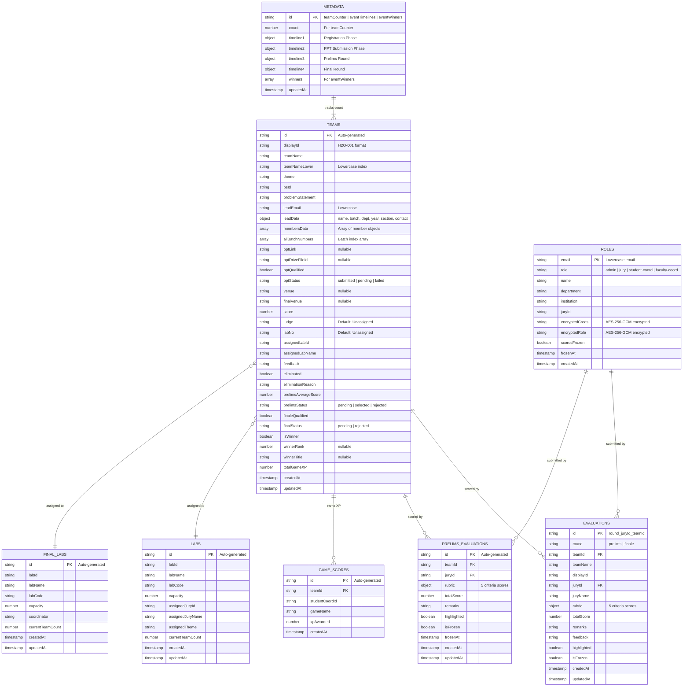

# 07 — Database Design

## ER Diagram



## Collection Details

### `teams`

**Purpose:** Stores all registered hackathon teams and their lifecycle state.

**Relationships:**
- Referenced by `evaluations.teamId`, `prelimsEvaluations.teamId`, `gameScores.teamId`.
- References `labs` via `assignedLabId`.
- References `finalLabs` via `finalVenue` (by name match).

**Example Document:**
```json
{
  "displayId": "H2O-042",
  "teamName": "CodeCrafters",
  "teamNameLower": "codecrafters",
  "theme": "AI & Machine Learning",
  "psId": "PS-01",
  "problemStatement": "AI-Powered Diagnostics in Healthcare",
  "leadEmail": "john@example.com",
  "leadData": {
    "name": "John Doe",
    "batchNumber": "123456",
    "department": "CSE",
    "year": "III",
    "section": "A",
    "contactNumber": "9876543210",
    "email": "john@example.com"
  },
  "membersData": [
    { "name": "Jane", "batchNumber": "123457", "department": "CSE", "year": "III", "section": "B" },
    { "name": "Bob", "batchNumber": "123458", "department": "IT", "year": "II" },
    { "name": "Alice", "batchNumber": "123459", "department": "AID", "year": "III", "section": "A" }
  ],
  "allBatchNumbers": ["123456", "123457", "123458", "123459"],
  "pptLink": "https://docs.google.com/presentation/d/...",
  "pptDriveFileId": "1abc...",
  "pptQualified": true,
  "pptStatus": "submitted",
  "assignedLabId": "lab_doc_id",
  "assignedLabName": "Lab 101",
  "labNo": "Lab 101",
  "judge": "Dr. Smith",
  "venue": "Lab 101",
  "prelimsAverageScore": 38.5,
  "prelimsStatus": "selected",
  "finaleQualified": true,
  "finalStatus": "pending",
  "finalVenue": "Main Auditorium",
  "isWinner": false,
  "winnerRank": null,
  "totalGameXP": 150,
  "createdAt": "2026-07-28T10:00:00Z"
}
```

### `roles`

**Purpose:** Maps privileged users to their roles. Team participants are NOT stored here.

**Key Design Decision:** The "team" role is a **fallback default**. If a user is authenticated via Firebase Auth but has no document in `roles`, they are treated as a `team` user. This prevents the `roles` collection from scaling with mass public registrations.

**Example Document (Jury):**
```json
{
  "role": "jury",
  "name": "Dr. Smith",
  "institution": "MIT",
  "encryptedCreds": "abc123:def456:ghi789",
  "scoresFrozen": false,
  "createdAt": "2026-07-28T10:00:00Z"
}
```

### `metadata`

**Purpose:** Stores global state including team counter and event timeline configuration.

**Documents:**

| Document ID | Fields |
|---|---|
| `teamCounter` | `count` (number) — next team sequential number. |
| `eventTimelines` | `timeline1–4` — each with `name`, `startDate`, `endDate`, `enabled`, `state`, and phase-specific flags. |
| `eventWinners` | `winners` (array of `{teamId, rank, title}`), `updatedAt`. |

### Constraints

- **Unique team names:** Enforced via `teamNameLower` field query and legacy doc ID check.
- **Unique batch numbers:** Enforced via `allBatchNumbers` array-contains-any query.
- **Unique privileged emails:** Enforced by checking `roles` doc existence before creation.
- **Sequential display IDs:** Generated via Firestore transaction on `metadata/teamCounter` with 5 retries for contention handling.

---

> **Related Documents:** [06_Firebase_Documentation](./06_Firebase_Documentation.md) · [08_API_and_Service_Layer](./08_API_and_Service_Layer.md)
