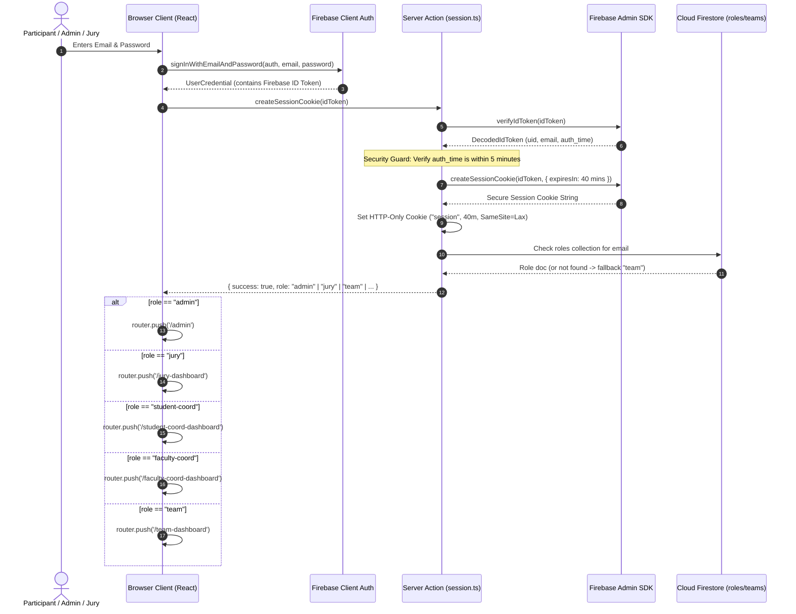

# 10 — Authentication Flow

## End-to-End Authentication Architecture

Hackwell 2.O implements a hybrid authentication model combining **Firebase Client SDK** (for initial credential validation) with **Firebase Admin SDK** (for minting and verifying secure, HttpOnly session cookies on the Next.js server).

---

## Detailed Step-by-Step Breakdown

### 1. User Registration (`/register`)
- Participants complete the 4-member form (1 Lead + 3 Members) validated via Zod schema.
- Client calls `createUserWithEmailAndPassword(auth, leadEmail, password)`.
- If user creation succeeds, client invokes `registerTeamData(...)` Server Action.
- The server action performs:
  1. Timeline verification (Registration phase active).
  2. Team name uniqueness check (case-insensitive).
  3. Batch number collision check across all participants.
  4. Display ID generation (`H2O-XXX` via atomic Firestore transaction).
  5. Persistence to `teams` collection.
- **Rollback Mechanism:** If Firestore persistence fails, `userCredential.user.delete()` is executed to prevent orphaned Firebase Auth users.

### 2. Login & Token Exchange (`/login`)
- File: `src/app/login/page.tsx` & `src/app/actions/session.ts`.
- The user signs in via Firebase Client SDK.
- The generated ID Token is sent to `createSessionCookie(idToken)`.
- The server calls `verifyIdToken(idToken)`:
  - Validates cryptographic signature using Google public keys.
  - Verifies expiration and ensures `auth_time` is less than 5 minutes old to prevent replay attacks.
- A session cookie valid for 40 minutes is generated via `getAdminAuth().createSessionCookie(idToken, { expiresIn })`.
- The cookie is stored as an `HttpOnly`, `Secure` (in production), `SameSite=Lax` cookie named `session`.

### 3. Role Resolution & Caching
- File: `src/app/actions/session.ts` -> `getUserRole(email)`.
- The server inspects the in-memory cache `roleCache` (TTL: 5 minutes).
- If cache misses, Firestore `roles` collection is queried using the normalized email (`doc(email.toLowerCase())`).
- If document exists, role is returned (`admin`, `jury`, `student-coord`, `faculty-coord`).
- If document is not found, the system defaults to `'team'`.
- Hardcoded whitelist fallback: `ADMIN_EMAILS` array provides immediate admin privileges for designated super-administrators.

### 4. Client-Side Desynchronization Mitigation
- When navigating to `/login`, an effect executes `signOut(auth)`.
- This ensures any lingering client-side Firebase Auth tokens are flushed, preventing race conditions where the UI believes the user is authenticated while server cookies have expired.

### 5. Logout Flow (`/login` or header buttons)
- File: `src/components/LogoutButton.tsx` and dashboard inline handlers.
- Step 1: `signOut(auth)` on client.
- Step 2: `clearSessionCookie()` Server Action expires the cookie (`maxAge: 0`).
- Step 3: `router.replace('/login')` or `router.replace('/')`.

---

## Session Token Security Specification

| Parameter | Configuration | Rationale |
|---|---|---|
| **Cookie Name** | `session` | Standardized name checked by middleware & actions |
| **HttpOnly** | `true` | Prevents XSS script access to session tokens |
| **Secure** | `process.env.NODE_ENV === 'production'` | Requires HTTPS in production environments |
| **SameSite** | `'lax'` | Protects against CSRF on state-changing navigations |
| **Path** | `'/'` | Universal scope across all App Router subpaths |
| **Max Age / Expiry** | 40 Minutes (`2400` seconds) | Enforces short-lived sessions for hackathon security |
| **Revocation Check** | `verifySessionCookie(cookie, true)` | `true` parameter forces check against revoked tokens |

---

## Password Reset Workflow

1. **Request:** Student enters lead email on `/forgot-password`.
2. **Verification:** Server checks `checkTeamEmailRegistered(email)`. Privileged roles (admin, jury, coord) are forbidden from using this flow.
3. **Execution:** On `/reset-password`, the student submits old password and new password.
4. **Validation:** Server verifies old password via Firebase Identity Toolkit REST API endpoint (`accounts:signInWithPassword`).
5. **Update:** Server updates password via Firebase Admin SDK `getAdminAuth().updateUser(uid, { password })`.

---

> **Related Documents:** [02_System_Architecture](./02_System_Architecture.md) · [11_Authorization_and_Roles](./11_Authorization_and_Roles.md) · [13_Security_Documentation](./13_Security_Documentation.md)
