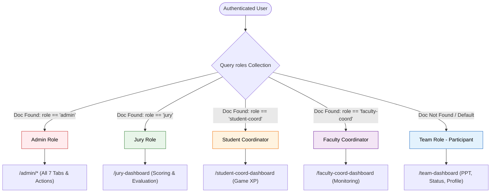

# 11 — Authorization and Roles

## Role-Based Access Control (RBAC) Architecture

Hackwell 2.O employs a multi-tiered Authorization model. Privileged roles are registered explicitly in the `roles` collection in Firestore, while public student participants dynamically default to the `team` role without requiring explicit entries in the roles collection.



---

## Role Permissions Matrix

| Feature / Action | Team (Participant) | Jury Member | Student Coord | Faculty Coord | Administrator |
|---|:---:|:---:|:---:|:---:|:---:|
| **Public Landing & Rules** | ✅ Read | ✅ Read | ✅ Read | ✅ Read | ✅ Read |
| **Team Registration** | ✅ Create | ❌ | ❌ | ❌ | ❌ |
| **View Own Team Dashboard** | ✅ Read | ❌ | ❌ | ❌ | ❌ |
| **Submit / Update PPT Link** | ✅ (Phase 2) | ❌ | ❌ | ❌ | ❌ |
| **Reset Own Password** | ✅ | ❌ | ❌ | ❌ | ❌ |
| **View Assigned Teams** | ❌ | ✅ Read | ❌ | ❌ | ✅ Read |
| **Evaluate Teams (Rubric /50)**| ❌ | ✅ Create/Edit | ❌ | ❌ | ✅ Read/Override |
| **Star / Highlight Teams** | ❌ | ✅ Toggle | ❌ | ❌ | ✅ Read |
| **Freeze Jury Scores** | ❌ | ✅ Execute | ❌ | ❌ | ✅ Unfreeze |
| **Assign Game XP** | ❌ | ❌ | ✅ Create | ❌ | ✅ Full CRUD |
| **Manage Event Timelines** | ❌ | ❌ | ❌ | ❌ | ✅ Full CRUD |
| **Auto-Allocate Labs & Juries**| ❌ | ❌ | ❌ | ❌ | ✅ Execute |
| **Promote Finalists** | ❌ | ❌ | ❌ | ❌ | ✅ Execute |
| **Declare Winners** | ❌ | ❌ | ❌ | ❌ | ✅ Execute |
| **User & Role Provisioning** | ❌ | ❌ | ❌ | ❌ | ✅ Full CRUD |
| **System Wipe & Seeding** | ❌ | ❌ | ❌ | ❌ | ✅ Execute |

---

## Verification Implementations

### 1. Edge Middleware Protection (`src/proxy.ts`)
The Edge Middleware runs prior to Next.js route execution. It inspects incoming cookies:
```typescript
const protectedRoutes = [
  '/team-dashboard',
  '/admin',
  '/jury-dashboard',
  '/student-coord-dashboard',
  '/faculty-coord-dashboard'
];
```
- If no `session` cookie exists, request is immediately redirected to `/login`.
- If an active cookie is detected when visiting `/login` or `/register`, request redirects to `/team-dashboard`.

### 2. Server Action Guard: `verifyAdminSession()`
File: `src/app/admin/actions.ts`
```typescript
export async function verifyAdminSession(): Promise<boolean> {
  const cookieStore = await cookies();
  const sessionCookie = cookieStore.get('session')?.value;
  if (!sessionCookie) return false;

  try {
    const decodedToken = await getAdminAuth().verifySessionCookie(sessionCookie, true);
    if (!decodedToken?.email) return false;
    
    const email = decodedToken.email.toLowerCase().trim();
    if (isAdminEmail(email)) return true;
    
    const role = await getUserRole(email);
    return role === 'admin';
  } catch (error) {
    return false;
  }
}
```

### 3. Server Action Guard: `verifyJurySession()`
File: `src/app/jury-dashboard/actions.ts`
- Verifies session cookie.
- Resolves role and confirms `role === 'jury'`.
- Fetches `scoresFrozen` status and jury metadata (`juryId`, `juryName`, `institution`).
- Rejects mutation requests (`saveEvaluation`, `toggleHighlight`) if `scoresFrozen === true`.

### 4. Server Component Guard: Team Dashboard
File: `src/app/team-dashboard/page.tsx`
- Runs directly on server during SSR.
- Verifies session token and retrieves user email.
- Confirms `getUserRole(email) === 'team'`. If role belongs to privileged user, redirects away to `/`.

---

## User Provisioning & Credential Storage

File: `src/app/admin/users-creator/actions.ts`

When administrators create privileged accounts (`Jury`, `Student Coordinator`, `Faculty Coordinator`):
1. Account created in Firebase Auth via `getAdminAuth().createUser({ email, password })`.
2. Encrypted payload generated via `encryptJSON({ password })` using AES-256-GCM.
3. Role metadata document saved in `roles/{email}` containing role, name, department/institution, and encrypted credentials.
4. Juries are optionally synchronized into the `jury` collection for lab allocation lookups.

---

> **Related Documents:** [04_Routing_Guide](./04_Routing_Guide.md) · [10_Authentication_Flow](./10_Authentication_Flow.md) · [13_Security_Documentation](./13_Security_Documentation.md)
