# 12 — Event Lifecycle and Workflow

## End-to-End Hackathon Workflow

Hackwell 2.O orchestrates the hackathon lifecycle through **4 distinct phases** configured in Firestore (`metadata/eventTimelines`).

```mermaid
stateDiagram-v2
    [*] --> Phase1_Registration: Event Launch
    
    state Phase1_Registration {
        [*] --> Open_Registration
        Open_Registration --> Team_Enrolled: 4 Students Submit Form
        Team_Enrolled --> Display_ID_Assigned: H2O-XXX Generated
    }

    Phase1_Registration --> Phase2_PPT_Submission: Admin Advances Phase / Timeline
    
    state Phase2_PPT_Submission {
        [*] --> Submission_Window_Open
        Submission_Window_Open --> Upload_Drive_PPT: Team Uploads Presentation
        Upload_Drive_PPT --> PPT_Filter_Applied: Admin Runs PPT Filter
        PPT_Filter_Applied --> Qualified: Submitted
        PPT_Filter_Applied --> Eliminated_PPT: Missing PPT
    }

    Phase2_PPT_Submission --> Phase3_Prelims_Round: Admin Auto-Allocates Labs

    state Phase3_Prelims_Round {
        [*] --> Lab_Jury_Allocation: Theme Matching Algorithm
        Lab_Jury_Allocation --> Jury_Evaluation: 5-Criteria Rubric (/50)
        Jury_Evaluation --> Scores_Frozen: Jury Locks Evaluation
        Scores_Frozen --> Promote_Top_Teams: Top N per Theme / Overall Selected
    }

    Phase3_Prelims_Round --> Phase4_Finale_Round: Finalists Published

    state Phase4_Finale_Round {
        [*] --> Final_Lab_Assignment: Auditorium / Lab Allocation
        Final_Lab_Assignment --> Final_Presentations: Live Demo & Finale Rubric
        Final_Presentations --> Declare_Winners: Top 1, 2, 3 + Theme Awards
    }

    Phase4_Finale_Round --> [*]: Event Concluded
```

---

## Detailed Phase Breakdown

### Phase 1: Team Registration
- **Configuration:** `timeline1` in `metadata/eventTimelines`.
- **Public Behavior:** `/register` allows teams to sign up. If timeline is inactive or disabled, a notice displays informing users that registration is closed.
- **Constraints:**
  - 1 Lead + 3 Members (strictly 4 members).
  - Batch number uniqueness checked against all existing teams.
  - Unique team name (checked in realtime via debounce).
  - Selection of 1 Theme and 1 Problem Statement from predefined catalog (`src/lib/data/themes.ts`).
- **Data Initialization:**
  - `prelimsStatus: 'pending'`
  - `finaleQualified: false`
  - `isWinner: false`
  - `totalGameXP: 0`
  - `labNo: 'Unassigned'`, `judge: 'Unassigned'`

---

### Phase 2: PPT Submission & Filtering
- **Configuration:** `timeline2` in `metadata/eventTimelines`.
- **Team Action:** Team leads access `/team-dashboard` to submit their presentation link.
- **Admin Actions (`/admin/event-management`):**
  - **Apply PPT Filter:** Automatically flags teams with valid `pptLink` as `pptQualified: true` and marks missing submissions as `eliminated: true` with reason `"Eliminated: Did not submit PPT presentation during Phase 2"`.
  - **PPT Verification Table:** Allows manual inspection of Google Drive links directly from the admin panel.

---

### Phase 3: Prelims Round & Lab Allocation
- **Configuration:** `timeline3` in `metadata/eventTimelines`.
- **Lab Setup:** Administrators configure labs (`src/app/admin/actions.ts` -> `createLabAdmin`):
  - Lab Name, Capacity, Assigned Jury, Assigned Theme.
- **Auto-Allocation Algorithm (`autoAssignTeamsToLabsAdmin`):**
  1. Filters all `pptQualified === true` teams.
  2. Groups configured labs by `assignedTheme`.
  3. Iterates through teams and assigns them to matching theme labs using round-robin distribution.
  4. Falls back to "General / Any Theme" labs if specific theme labs reach capacity.
  5. Updates team records with `assignedLabId`, `assignedLabName`, `labNo`, `judge`, and `venue`.
- **Jury Evaluation:**
  - Juries log into `/jury-dashboard`.
  - Teams in their lab or allocated pool appear in the evaluation list.
  - Scores entered across 5 rubric fields (0–10 each):
    1. Problem Statement (PS)
    2. Presentation
    3. Communication
    4. Solution
    5. Idea
  - Total score calculated (/50).
  - Juries click **Freeze Scores** to permanently lock evaluations.
- **Promotion to Finale (`promoteTopTeamsToFinaleAdmin`):**
  - Admin calculates average scores across evaluations.
  - Top teams (either by global rank or top N per theme) are flagged with `finaleQualified: true` and `prelimsStatus: 'selected'`.
  - Unselected teams transition to `prelimsStatus: 'rejected'`.

---

### Phase 4: Finale Round & Winner Declaration
- **Configuration:** `timeline4` in `metadata/eventTimelines`.
- **Final Lab Setup (`finalLabs` collection):**
  - Final presentation venues (e.g., Auditorium, Executive Lab) created with capacity and faculty coordinators.
- **Final Auto-Allocation (`autoAssignFinalTeamsToLabsAdmin`):**
  - Qualified finalists (`finaleQualified === true`) distributed across final labs.
- **Finale Evaluation:**
  - Final evaluations recorded via `/admin/finale-scores` or jury panels.
- **Winner Declaration (`setFinalWinnersAdmin`):**
  - Admin assigns rankings (1st Place, 2nd Place, 3rd Place, Theme Winner, Special Mention).
  - Updates `teams` document (`isWinner: true`, `winnerRank`, `winnerTitle`).
  - Persists winners snapshot into `metadata/eventWinners`.

---

## Game XP & Engagement System

- Throughout the hackathon, Student Coordinators conduct mini-games and technical quizzes.
- Scores submitted via `gameScores` collection.
- Teams accumulate `totalGameXP` which powers the real-time engagement leaderboard on the Team Dashboard.

---

> **Related Documents:** [07_Database_Design](./07_Database_Design.md) · [08_API_and_Service_Layer](./08_API_and_Service_Layer.md) · [11_Authorization_and_Roles](./11_Authorization_and_Roles.md)
