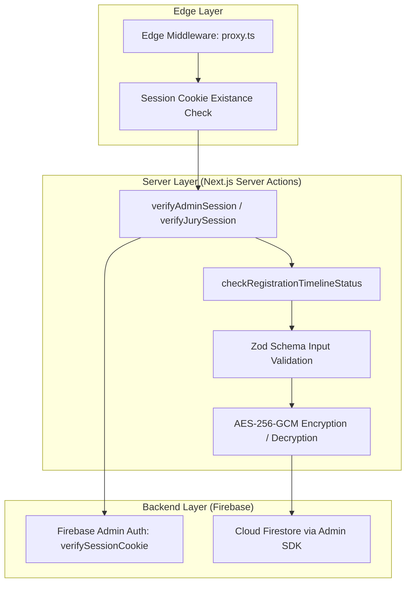

# 13 — Security Documentation

## Security Architecture Overview

Hackwell 2.O adheres to defense-in-depth principles across client interactions, edge routing, server-side actions, and database storage.



---

## Security Layers & Mitigations

### 1. Authentication & Session Security
- **HttpOnly Cookies:** Client scripts (XSS payloads) cannot access the `session` cookie.
- **Short-Lived Expiration:** Session tokens expire after 40 minutes, minimizing window of opportunity for stolen session tokens.
- **Revocation Checking:** `verifySessionCookie(cookie, true)` validates that the underlying Firebase user hasn't been disabled, deleted, or had their tokens revoked.
- **Replay Attack Defense:** During login, `auth_time` inside the ID token is checked to guarantee it was issued within the last 5 minutes.

### 2. Encryption at Rest (`src/lib/encryption.ts`)
- **Algorithm:** `AES-256-GCM` (Authenticated Encryption with Associated Data).
- **Format:** `iv:authTag:encryptedPayload` in hexadecimal format.
- **Key Specification:** 32-byte key defined via `ENCRYPTION_KEY` environment variable.
- **Application:** Used to encrypt sensitive credentials in the `roles` collection (e.g. provisioned jury/coordinator initial passwords).

```typescript
// Sample implementation from src/lib/encryption.ts
export function encrypt(text: string): string {
  const iv = crypto.randomBytes(16);
  const cipher = crypto.createCipheriv('aes-256-gcm', key, iv);
  let encrypted = cipher.update(text, 'utf8', 'hex');
  encrypted += cipher.final('hex');
  const authTag = cipher.getAuthTag().toString('hex');
  return `${iv.toString('hex')}:${authTag}:${encrypted}`;
}
```

### 3. Input Validation & Sanitization
- **Strict Zod Schemas:** Form inputs across registration, login, and jury scoring are strictly validated:
  - Batch number: exactly 6 digits regex (`/^\d{6}$/`).
  - Contact number: minimum 10 digits.
  - Rubric criteria: strictly integer between 0 and 10.
  - Password complexity: minimum 8 characters, at least 1 uppercase, 1 lowercase, 1 number, and 1 special character.
- **Normalization:** Emails and team names are normalized to lowercase (`email.toLowerCase().trim()`) before queries to prevent case-manipulation collisions.

### 4. Concurrency & Integrity Controls
- **Display ID Generation:** Display IDs (`H2O-XXX`) are generated inside atomic Firestore transactions with up to 5 retries to prevent duplicate identifier assignment under heavy registration traffic.
- **Score Freezing:** Juries can submit evaluations until frozen. Once `scoresFrozen: true` is committed, server actions reject any subsequent update calls.

### 5. File Upload Security
- Direct binary file upload to the Next.js application server is avoided.
- Large presentation files are handled via external Google Apps Script / Google Drive proxy, mitigating server disk exhaustion and remote code execution vulnerabilities.
- `experimental.serverActions.bodySizeLimit` is set to 20MB in `next.config.ts` to accommodate structured submissions while bounding memory consumption.

---

## Security Audit & Vulnerability Assessment

| Vulnerability Vector | Current Mitigation | Recommended Hardening |
|---|---|---|
| **Firestore Direct Client Access** | All client reads/writes route through server actions (Admin SDK) | Deploy explicit Firestore Rules denying all client access (`allow read, write: if false;`) |
| **API Abuse / Rate Limiting** | Debounced search & batch checking | Integrate `@upstash/ratelimit` on registration and login endpoints |
| **CORS / CSRF** | `SameSite: Lax` on cookies, Next.js Server Actions origin validation | Configure explicit Content Security Policy (CSP) headers in `next.config.ts` |
| **Hardcoded Admin Whitelist** | Fallback in `session.ts` | Migrate all admin privileges exclusively to database roles with audit logging |

---

> **Related Documents:** [06_Firebase_Documentation](./06_Firebase_Documentation.md) · [10_Authentication_Flow](./10_Authentication_Flow.md) · [19_Environment_Variables](./19_Environment_Variables.md)
