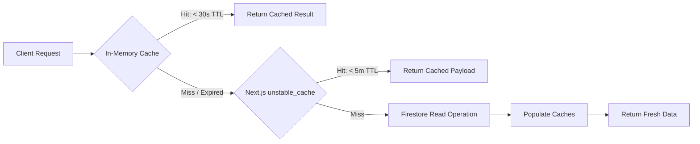

# 14 — Performance and Optimization

## Performance Architecture Overview

Hackwell 2.O is engineered to handle spikes in traffic during critical hackathon events (launch of registration, prelims scoring, and finale results). It employs caching tiers, selective rendering, bundle optimization, and database query minimization.

---

## Caching Strategy



### 1. In-Memory Role Cache (`src/app/actions/session.ts`)
- **TTL:** 5 Minutes (`5 * 60 * 1000 ms`).
- **Storage:** Server-side `Map<string, { role: string; timestamp: number }>`.
- **Impact:** Eliminates redundant Firestore reads on every authenticated page navigation.

### 2. Admin Collection Cache (`src/app/admin/actions.ts`)
- **TTL:** 30 Seconds (`30 * 1000 ms`).
- **Tracked Collections:** `teams`, `labs`, `roles`, `gameScores`, `metadata_eventTimelines`.
- **Invalidation:** Explicit invalidation triggered via `invalidateCollectionCache('collectionName')` immediately after write operations (`createLabAdmin`, `updateTeamAdmin`, `deleteLabAdmin`, etc.).

### 3. Next.js Data Cache (`unstable_cache`)
- Applied to large aggregations such as `getAllTeamsAdmin()` with a 5-minute revalidation window.

---

## Rendering & Component Optimization

| Area | Implementation | Performance Benefit |
|---|---|---|
| **Landing Page (`/`)** | Static Server Component | Pre-rendered at build time; 0ms Time to First Byte (TTFB) |
| **Team Dashboard** | Hybrid SSR (`page.tsx` + `TeamDashboardClient.tsx`) | Server fetches data in parallel with session verification; no layout shift (CLS) |
| **Jury Dashboard** | Optimistic UI updates | Star toggles and scoring updates apply immediately in local state prior to network resolution |
| **Registration Form** | Debounced Validation (500ms - 800ms) | Live team name and batch number checks prevent hammering Firestore on every keystroke |

---

## Database Query Optimization

1. **Batching:** Seeding (`seedDummyTeamsAdmin`) and bulk allocations (`autoAssignTeamsToLabsAdmin`) utilize Firestore Batched Writes (`db.batch()`) in chunks of 400 operations, minimizing round trips.
2. **Selective Indexing:** Case-insensitive search queries target `teamNameLower` instead of executing client-side filtering over all documents.
3. **Array Lookups:** Batch collision checks use `array-contains-any` on `allBatchNumbers` to validate all 4 team members in a single query.
4. **Quota Resilience:** High-frequency read handlers incorporate fallback paths for `RESOURCE_EXHAUSTED` errors when operating on Firebase Spark (Free Tier) limits.

---

## Build & Bundle Optimization

### `next.config.ts` Configuration
```typescript
import type { NextConfig } from "next";

const nextConfig: NextConfig = {
  experimental: {
    serverActions: {
      bodySizeLimit: '20mb',
    },
  },
};

export default nextConfig;
```

### Font Optimization
Google Fonts (`Geist Sans`, `Geist Mono`) are imported using `next/font/google` in `layout.tsx`, eliminating external font render-blocking requests and preventing layout shifts.

---

## Bottlenecks & Scaling Recommendations

1. **Pagination:** Currently `getAllTeamsAdmin` loads all teams into memory. For hackathons with > 500 teams, implement cursor-based pagination using Firestore `.startAfter()`.
2. **Real-time Listeners:** For live admin score monitoring during prelims, replace polling with Firestore `onSnapshot` WebSockets where real-time accuracy is critical.
3. **Redis / Upstash Layer:** Move in-memory cache to a distributed Redis instance if scaling to multiple serverless container replicas.

---

> **Related Documents:** [02_System_Architecture](./02_System_Architecture.md) · [07_Database_Design](./07_Database_Design.md) · [18_Deployment_Guide](./18_Deployment_Guide.md)
