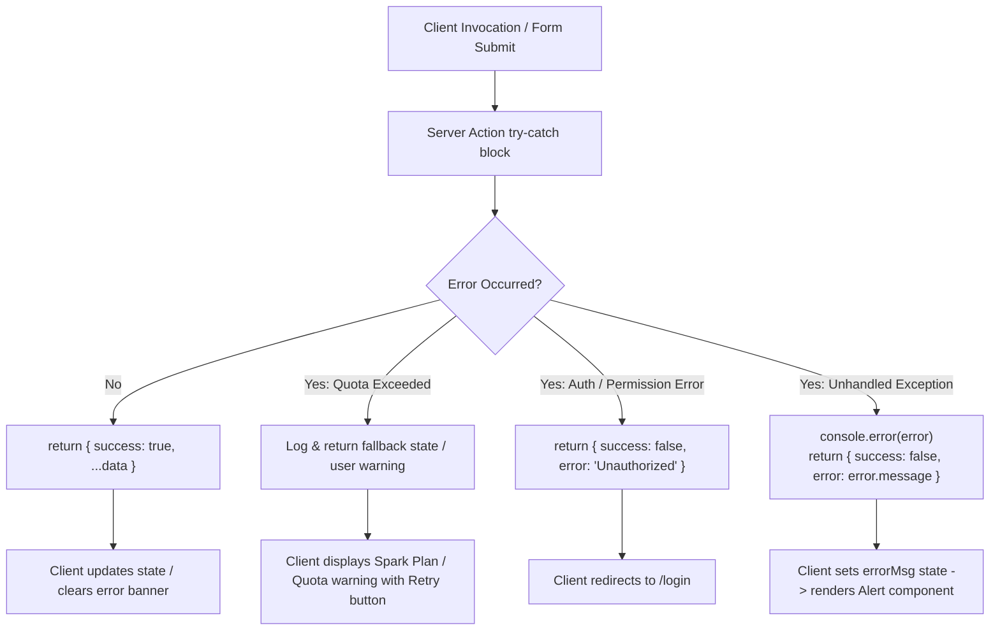

# 15 — Error Handling

## Error Handling Architecture

Hackwell 2.O employs structured, defensive error handling across client interactions, Server Actions, and database operations.



---

## Standard Server Action Response Contract

All Server Actions follow a consistent return type pattern:

```typescript
export type ServerActionResult<T = Record<string, any>> = {
  success: boolean;
  error?: string;
} & T;
```

### Example Implementation Pattern
```typescript
export async function createLabAdmin(labName: string, capacity: number): Promise<{ success: boolean; error?: string }> {
  try {
    const valid = await verifyAdminSession();
    if (!valid) return { success: false, error: 'Unauthorized' };

    if (!labName?.trim()) {
      return { success: false, error: 'Lab Name is required.' };
    }

    const db = getAdminDb();
    await db.collection('labs').add({ labName, capacity, createdAt: new Date() });
    
    invalidateCollectionCache('labs');
    return { success: true };
  } catch (error: any) {
    console.error('Error creating lab:', error);
    return { success: false, error: error.message || 'Failed to create lab' };
  }
}
```

---

## Specific Error Patterns & Handlers

### 1. Database Quota Limits (`RESOURCE_EXHAUSTED`)
When running on Firebase Spark (Free Tier), high traffic may hit read/write quotas.
- **Handling in `src/app/actions/auth.ts`:**
  ```typescript
  if (err?.code === 8 || err?.message?.includes('RESOURCE_EXHAUSTED')) {
    return {
      success: false,
      error: 'Firebase database quota reached. Please wait a few minutes or upgrade your plan.',
    };
  }
  ```
- **Handling in `src/app/team-dashboard/page.tsx`:**
  Renders a fallback UI with an explicit retry button and guidance explaining potential Firebase Spark tier limits.

### 2. Transaction Contention (Display ID Generation)
During simultaneous team registrations, the sequential counter transaction on `metadata/teamCounter` may encounter contention.
- **Handler:** Implements 5 automated retry loops with exponential backoff before returning an error to the user.

### 3. Client Registration Rollback
If Firebase Auth user creation succeeds but Firestore document registration fails (e.g. schema error or network drop), the created user is immediately deleted:
```typescript
try {
  const result = await registerTeamData(...);
  if (!result.success) {
    await userCredential.user.delete();
    throw new Error(result.error);
  }
} catch (err: any) {
  setError(err.message);
}
```

### 4. Client-Side Desync & Stale Tokens
If a user arrives at `/login` with an active client SDK token but expired server session, `useEffect` calls `signOut(auth)` to purge local IndexedDB tokens, avoiding stale state loops.

---

## Client-Side Error Presentation

| Component | Visual Presentation | Dismissal Behavior |
|---|---|---|
| **Login / Register** | Red alert banner above form fields | Auto-clears on form resubmission |
| **Jury Dashboard** | Sticky status banner (`AlertTriangle` icon) | Auto-fades after 4 seconds on success |
| **Admin Tabs** | Inline alert box with descriptive message | Persists until next successful action |
| **Team Dashboard** | Full-screen error card with retry button | Reloads page on user click |

---

> **Related Documents:** [08_API_and_Service_Layer](./08_API_and_Service_Layer.md) · [09_State_Management](./09_State_Management.md) · [21_Troubleshooting_and_FAQ](./21_Troubleshooting_and_FAQ.md)
