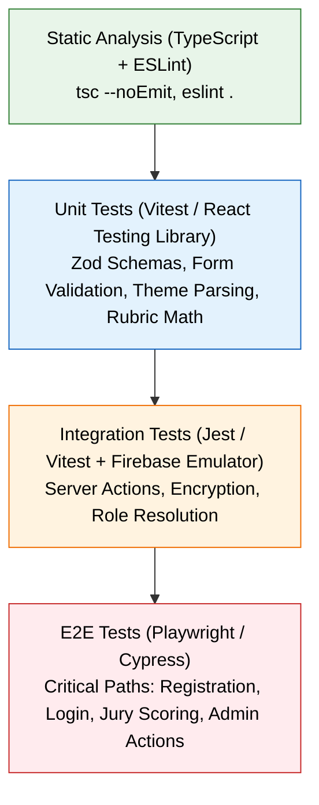

# 16 — Testing Strategy

## Testing Philosophy & Current Status

Hackwell 2.O is currently validated primarily through **manual integration testing**, **smoke testing**, and **type-level compile checks**. This document establishes the testing strategy, existing validation procedures, and a roadmap for automated test coverage.

---

## Testing Pyramid & Recommendations



---

## Verification Procedures

### 1. Static Type & Lint Verification
Execute static checks prior to any deployment:
```bash
# Type check TypeScript codebase
npm run build
# Or run linting
npm run lint
```

### 2. Manual Test Matrix

| Area | Test Case | Expected Result |
|---|---|---|
| **Registration** | Submit 4 valid members with distinct batch numbers | User created in Auth + `teams` doc with `H2O-XXX` display ID |
| **Registration** | Submit duplicate batch number | Immediate warning: "Batch number already taken" |
| **Registration** | Submit duplicate team name | Input flag shows "Taken", submission disabled |
| **Login** | Sign in as team lead | Redirects to `/team-dashboard` |
| **Login** | Sign in as jury member | Redirects to `/jury-dashboard` |
| **Login** | Sign in as admin | Redirects to `/admin` |
| **Jury Scoring** | Enter rubric scores (e.g., 8, 9, 7, 8, 9) | Total calculates to 41/50, persists in `prelimsEvaluations` |
| **Jury Freeze** | Click "Freeze Scores" | Status changes to "Locked", edit inputs disabled |
| **Admin Allocation**| Run "Auto-Assign Teams to Labs" | PPT-submitted teams evenly assigned to theme-matching labs |
| **Event Timeline** | Disable Registration phase | `/register` displays registration closed notice |

---

## Recommended Automated Testing Setup

### 1. Unit Testing with Vitest
Install Vitest for rapid unit testing of schemas and utility functions:
```bash
npm install -D vitest @vitejs/plugin-react jsdom @testing-library/react
```

**Unit Test Targets:**
- `src/lib/encryption.ts`: Test encryption and decryption integrity for strings and complex JSON payloads.
- `src/app/register/page.tsx` Zod schemas: Test batch number regex, password complexity, and 4-member constraints.
- `src/lib/data/themes.ts`: Test theme resolution and problem statement lookup.

### 2. Integration Testing with Firebase Local Emulator Suite
Run tests against local emulated Firestore and Auth without incurring cloud costs or modifying production data:
```bash
# Install Firebase Tools
npm install -g firebase-tools

# Initialize Emulators
firebase init emulators

# Start Emulators
firebase emulators:start
```

### 3. End-to-End Testing with Playwright
```bash
npm install -D @playwright/test
```
**Key E2E Test Scenarios:**
1. Complete team registration journey from landing page to dashboard.
2. Jury scoring flow: login → select team → assign scores → freeze.
3. Admin lifecycle flow: advance phases → auto-allocate labs → promote finalists → declare winners.

---

> **Related Documents:** [15_Error_Handling](./15_Error_Handling.md) · [17_Developer_Setup](./17_Developer_Setup.md) · [20_Coding_Standards_and_Conventions](./20_Coding_Standards_and_Conventions.md)
