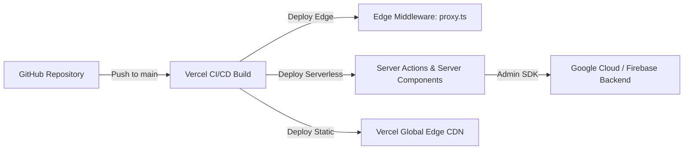

# 18 — Deployment Guide

## Deployment Overview

Hackwell 2.O is built with the **Next.js App Router** and is optimized for deployment on serverless platforms such as **Vercel**, **AWS Amplify**, or containerized environments (Docker / Google Cloud Run).



---

## Recommended Platform: Vercel

### 1. Initial Setup
1. Push your repository to GitHub / GitLab / Bitbucket.
2. Log into [Vercel Dashboard](https://vercel.com) and click **"Add New Project"**.
3. Import the `Hackwell` repository.

### 2. Configure Environment Variables
In the Vercel Project Settings under **Environment Variables**, configure:

| Variable Name | Environment | Description |
|---|---|---|
| `NEXT_PUBLIC_FIREBASE_API_KEY` | Production, Preview | Firebase Web API Key |
| `NEXT_PUBLIC_FIREBASE_AUTH_DOMAIN` | Production, Preview | Firebase Auth Domain |
| `NEXT_PUBLIC_FIREBASE_PROJECT_ID` | Production, Preview | Firebase Project ID |
| `NEXT_PUBLIC_FIREBASE_STORAGE_BUCKET`| Production, Preview | Storage Bucket URL |
| `NEXT_PUBLIC_FIREBASE_MESSAGING_SENDER_ID` | Production, Preview | Sender ID |
| `NEXT_PUBLIC_FIREBASE_APP_ID` | Production, Preview | Firebase App ID |
| `FIREBASE_CLIENT_EMAIL` | Production, Preview | Service Account Email |
| `FIREBASE_PRIVATE_KEY` | Production, Preview | Service Account Private Key (preserve `\n`) |
| `ENCRYPTION_KEY` | Production, Preview | 64-character hex string |
| `NEXT_PUBLIC_GOOGLE_SCRIPT_URL` | Production, Preview | Google Apps Script URL |

> **Vercel Secret Formatting Note:** For `FIREBASE_PRIVATE_KEY`, you can paste the private key directly with literal newlines or `\n` escapes. The helper in `src/lib/firebase-admin.ts` automatically executes `.replace(/\\n/g, '\n')`.

### 3. Build Settings
- **Framework Preset:** Next.js
- **Build Command:** `npm run build`
- **Output Directory:** `.next`
- **Install Command:** `npm install`

---

## Alternative: Docker Deployment

If deploying to **Google Cloud Run**, **AWS ECS**, or a custom VPS:

### `Dockerfile`
```dockerfile
FROM node:20-alpine AS base

# Install dependencies only when needed
FROM base AS deps
RUN apk add --no-cache libc6-compat
WORKDIR /app
COPY package.json package-lock.json ./
RUN npm ci

# Rebuild the source code only when needed
FROM base AS builder
WORKDIR /app
COPY --from=deps /app/node_modules ./node_modules
COPY . .
ENV NEXT_TELEMETRY_DISABLED=1
RUN npm run build

# Production image, copy all the files and run next
FROM base AS runner
WORKDIR /app
ENV NODE_ENV=production
ENV NEXT_TELEMETRY_DISABLED=1

RUN addgroup --system --gid 1001 nodejs
RUN adduser --system --uid 1001 nextjs

COPY --from=builder /app/public ./public
COPY --from=builder --chown=nextjs:nodejs /app/.next ./.next
COPY --from=builder /app/node_modules ./node_modules
COPY --from=builder /app/package.json ./package.json

USER nextjs
EXPOSE 3000
ENV PORT=3000
ENV HOSTNAME="0.0.0.0"

CMD ["npm", "run", "start"]
```

---

## Post-Deployment Checklist

- [ ] Verify homepage loads with 200 OK.
- [ ] Test team registration with mock data.
- [ ] Test login routing for both student team and administrator.
- [ ] Verify `session` cookie contains `Secure` flag over HTTPS.
- [ ] In Firebase Console, ensure Firestore indexes are built.
- [ ] Verify Google Apps Script PPT proxy endpoint responds to submissions.

---

> **Related Documents:** [17_Developer_Setup](./17_Developer_Setup.md) · [19_Environment_Variables](./19_Environment_Variables.md)
