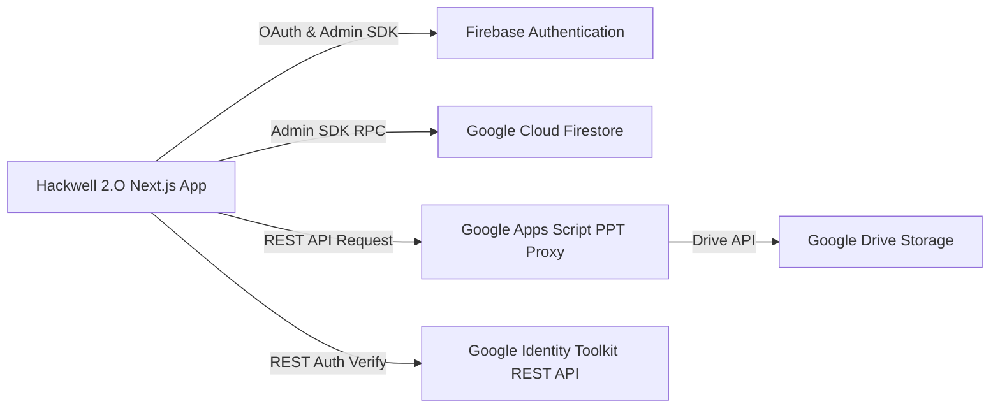

# 24 — Third-Party Integrations

## External Services & Integration Architecture

Hackwell 2.O integrates with external cloud platforms and Google Developer APIs to manage authentication, persistence, and presentation submissions.

---

## 1. Firebase Authentication
- **Purpose:** Secure identity management, credential hashing, and user token lifecycle.
- **Client Integration:** `@firebase/auth` initializes client session listeners.
- **Admin Integration:** `firebase-admin/auth` performs server-side ID token decoding, session cookie generation, and user CRUD operations.
- **Configuration:** Managed via `src/lib/firebase.ts` and `src/lib/firebase-admin.ts`.

---

## 2. Google Cloud Firestore
- **Purpose:** Scalable NoSQL document database storing teams, roles, evaluations, labs, and event metadata.
- **Integration:** Initialized via `firebase-admin/firestore` (`getAdminDb()`).
- **Optimization:** Utilizes batched writes (`db.batch()`) and atomic transactions (`db.runTransaction()`).

---

## 3. Google Apps Script & Google Drive (PPT Proxy)
- **Purpose:** Securely proxy presentation uploads into a designated Google Drive folder without requiring client-side Google OAuth scopes for each student.
- **Configuration:** Endpoint URL specified in `NEXT_PUBLIC_GOOGLE_SCRIPT_URL`.
- **Workflow:**
  1. Student uploads PPT on `/team-dashboard`.
  2. Request forwarded to Google Apps Script Web App endpoint.
  3. Script saves file to Drive and returns public view link + Drive File ID.
  4. Server Action saves link in team's Firestore record (`pptLink`, `pptDriveFileId`).

---

## 4. Google Identity Toolkit REST API
- **Purpose:** Programmatic verification of user passwords during the password reset workflow (`src/app/actions/forgot-password.ts`).
- **Endpoint:** `https://identitytoolkit.googleapis.com/v1/accounts:signInWithPassword?key={API_KEY}`.
- **Usage:** Validates the student's existing password prior to applying an updated password via Admin SDK.

---

> **Related Documents:** [06_Firebase_Documentation](./06_Firebase_Documentation.md) · [10_Authentication_Flow](./10_Authentication_Flow.md) · [19_Environment_Variables](./19_Environment_Variables.md)
